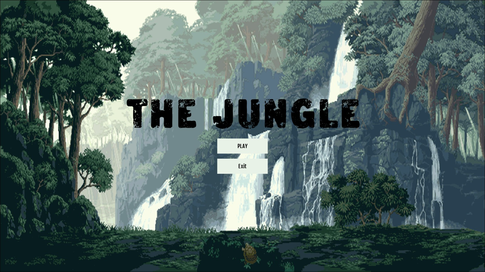
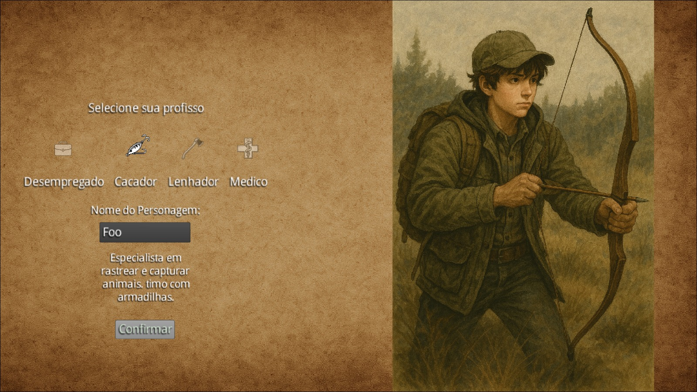

# The Jungle - Java LPOO

## Sobre o Jogo
The Jungle é um jogo de sobrevivência onde você acorda após um acidente de avião na selva e precisa explorar, encontrar recursos e sobreviver. Desenvolvido em Java com [libGDX](https://libgdx.com/), o jogo apresenta geração procedural de mapas e diferentes classes de personagens para escolher.

### Menu Principal  


### Seleção de Personagem


## Como Jogar
1. Na tela inicial, clique em "PLAY" para iniciar
2. Assista à sequência de introdução (tecle ESPAÇO para pular)
3. Escolha sua profissão entre as opções disponíveis:
   - **Desempregado**: Sem ocupação atual, mas com potencial para aprender qualquer coisa
   - **Caçador**: Especialista em rastrear e capturar animais, ótimo com armadilhas
   - **Lenhador**: Forte e resistente, coleta madeira com eficiência
   - **Médico**: Capaz de curar aliados e manter o grupo vivo durante emergências
4. Digite seu nome e confirme sua seleção
5. Explore o mapa gerado proceduralmente usando as teclas WASD

## Estrutura do Jogo
O jogo é dividido em várias telas:
- **Menu Principal**: Entrada do jogo
- **Tela de Loading**: Animação do acidente de avião
- **Tela da Carta**: História introdutória
- **Tela de Seleção de Personagem**: Escolha de profissão e nome
- **Tela de Jogo**: Onde a exploração ocorre em mapas gerados proceduralmente

## Controles
- **WASD**: Movimentação do personagem
- **ESPAÇO**: Pular cutscenes
- **BACKSPACE**: Voltar (quando disponível)

## Como Executar o Jogo
### Pré-requisitos
- Java JDK 11 ou superior (JDK 17 recomendado)
- Gradle (incluído no wrapper)

### Passos para Execução
1. Clone o repositório:
   ```
   git clone https://github.com/seu-usuario/The-Jungle.git
   cd The-Jungle
   ```

2. Execute o jogo com Gradle:
   ```
   ./gradlew lwjgl3:run
   ```
   
   Ou no Windows:
   ```
   gradlew.bat lwjgl3:run
   ```

3. Para gerar um arquivo JAR executável:
   ```
   ./gradlew lwjgl3:jar
   ```
   O arquivo JAR será gerado em `lwjgl3/build/libs`

### Executando com IntelliJ IDEA
1. Abra o IntelliJ IDEA e selecione "Open" ou "Import Project"
2. Navegue até a pasta do projeto The-Jungle e selecione-a
3. Aguarde o IntelliJ importar o projeto e resolver as dependências do Gradle
4. Configure uma Run Configuration:
   - Clique em "Edit Configurations..." no menu suspenso de configurações de execução
   - Clique no "+" e selecione "Application"
   - Configure os seguintes parâmetros:
     - Name: `The Jungle`
     - Main class: `io.github.com.ranie_borges.thejungle.lwjgl3.Lwjgl3Launcher`
     - Working directory: `$PROJECT_DIR$/lwjgl3`
     - Use classpath of module: `The-Jungle.lwjgl3.main`
   - Clique em "Apply" e depois em "OK"
5. Execute o projeto clicando no botão de play verde ou usando o atalho Shift+F10

## Estrutura do Projeto
- `core`: Módulo principal com a lógica do jogo compartilhada por todas as plataformas
- `lwjgl3`: Plataforma desktop usando LWJGL3

## Desenvolvimento
Este projeto usa Gradle para gerenciar dependências. Alguns comandos úteis:
- `./gradlew build`: Compila e empacota todos os projetos
- `./gradlew clean`: Remove as pastas `build` que contêm classes compiladas
- `./gradlew lwjgl3:run`: Executa a aplicação
- `./gradlew test`: Executa testes unitários (se houver)

## Créditos
Desenvolvido como projeto para a disciplina de LPOO (Linguagem de Programação Orientada a Objetos).
